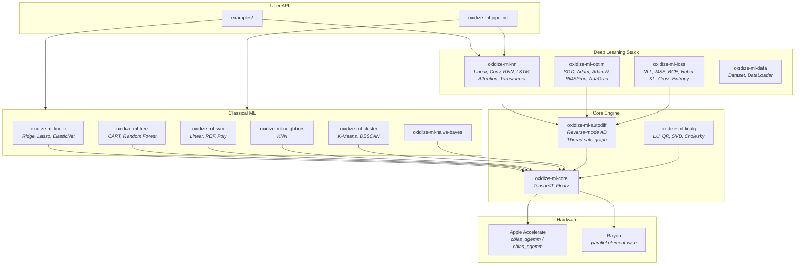
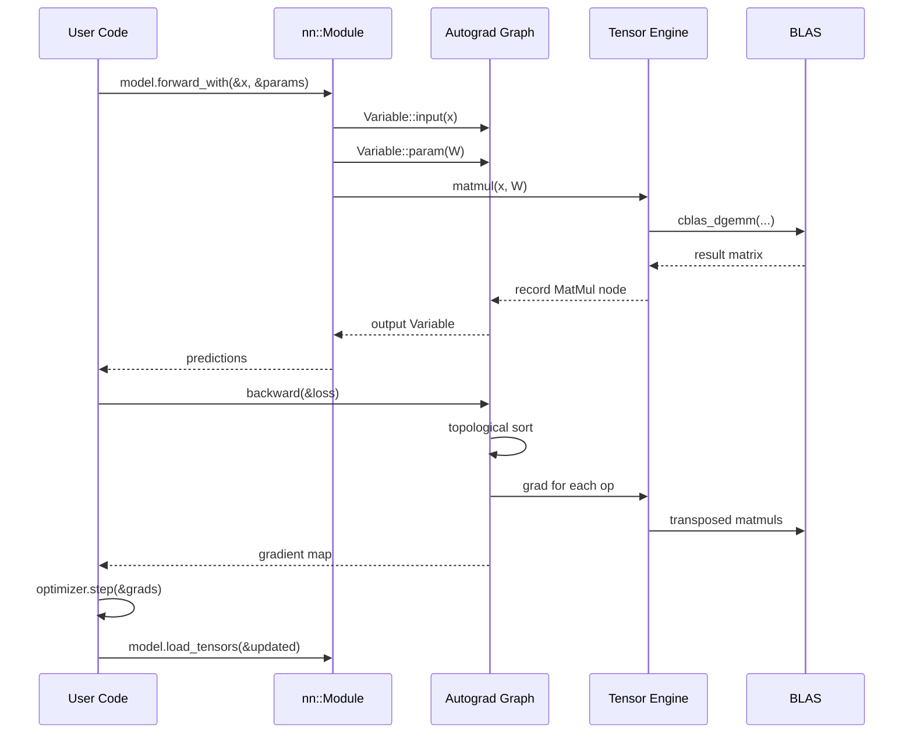
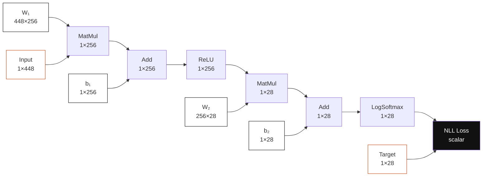
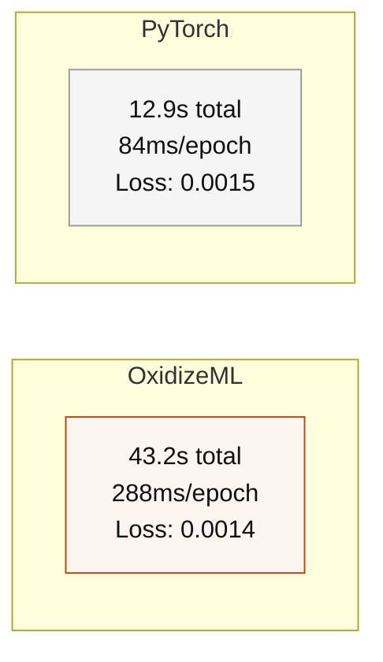

# OxidizeML

A machine learning framework written from scratch in Rust.  
No Python runtime. No C++ bindings. No libtorch dependency.

[](https://www.rust-lang.org)
[](https://developer.apple.com/accelerate/)
[](LICENSE)

**[Live Demo](https://hamza2masmoudi.github.io/OxidizeML/)** — interactive benchmark, text generator, and Word2Vec explorer.

---

## What this is

OxidizeML implements a complete training stack in pure safe Rust: a generic tensor engine, reverse-mode automatic differentiation, neural network layers and modules, optimizers with persistent state, and a classical ML library. It reaches the same convergence as PyTorch on identical architectures, compiling to a 3MB static binary with sub-millisecond cold start.

---

## System Architecture



---

## Training Pipeline

How a forward-backward pass flows through the system:



---

## Computation Graph

The actual DAG that OxidizeML constructs for a two-layer classifier:



Each node records its operation and parent pointers. `backward()` walks this graph in reverse topological order, computing gradients via the chain rule.

---

## Benchmark

Head-to-head: character-level language model on Shakespeare, 150 epochs, AdamW, identical architecture.



|                | OxidizeML     | PyTorch       |
|----------------|:-------------:|:-------------:|
| Training time  | 43.2s         | 12.9s         |
| Per epoch      | 288ms         | 84ms          |
| Final loss     | 0.0014        | 0.0015        |
| Binary size    | 3 MB          | ~2 GB         |
| Cold start     | <1ms          | ~1.5s         |
| Dependencies   | 0             | Python + libtorch |

PyTorch is faster because it dispatches to fused C++ backward kernels. OxidizeML achieves the same convergence in pure Rust.

BLAS throughput via Apple Accelerate:

| Matrix      | GFLOPS |
|:-----------:|:------:|
| 32 x 32     | 96     |
| 128 x 128   | 267    |
| 512 x 512   | 410    |
| 1024 x 1024 | 380    |

---

## Quick start

```bash
cargo build --workspace --release
```

```bash
# Regression (converges in <1s)
cargo run --release --bin train_regression

# Shakespeare text generation
cargo run --release --bin generate_text

# Word2Vec skip-gram
cargo run --release --bin train_word2vec

# BLAS throughput
cargo run --release --bin benchmark_matmul
```

---

## Code

Train a classifier in twenty lines:

```rust
use oxidize_ml_core::Tensor;
use oxidize_ml_autodiff::{Variable, backward, reset_graph};
use oxidize_ml_loss::nll_loss;
use oxidize_ml_optim::{AdamW, Optimizer};

let model = ModuleSequential::new()
    .add(DenseModule::new(784, 256))
    .add(ReLUModule)
    .add(DenseModule::new(256, 10))
    .add(LogSoftmaxModule);

let mut opt = AdamW::new(model.collect_tensors(), 0.001);

for epoch in 0..100 {
    reset_graph();
    let pvars = model.make_param_vars();
    let out   = model.forward_with(&x, &pvars);
    let loss  = nll_loss(&out, &target);
    let grads = backward(&loss);
    opt.rebind(pvars.iter().map(|v| v.node_id).collect());
    model.load_tensors(&opt.step(&grads));
}
```

Zero-overhead inference:

```rust
with_no_grad(|| {
    let out = model.forward_with(&input, &params);
    // No graph nodes allocated. Pure computation.
});
```

---

## Crate reference

### Core

| Crate | Purpose |
|-------|---------|
| `oxidize-ml-core` | `Tensor<T: Float>`, BLAS matmul, Rayon parallelism |
| `oxidize-ml-linalg` | LU, QR, Cholesky, SVD, solve, inverse |
| `oxidize-ml-autodiff` | Reverse-mode AD, thread-safe graph, `no_grad` |

### Neural networks

| Crate | Contents |
|-------|----------|
| `oxidize-ml-nn` | Linear, Conv1D/2D, RNN/GRU/LSTM, BatchNorm, Dropout, Embedding, MultiHeadAttention, TransformerBlock, `nn::Module` trait |
| `oxidize-ml-optim` | SGD, Adam, AdamW, RMSProp, AdaGrad, StepLR, CosineAnnealing, Warmup |
| `oxidize-ml-loss` | NLL, MSE, BCE, cross-entropy, Huber, hinge, KL-divergence, cosine |
| `oxidize-ml-data` | Dataset trait, DataLoader with batching and shuffling |

### Classical ML

| Crate | Algorithms |
|-------|------------|
| `oxidize-ml-linear` | Ridge, Lasso, Elastic Net, Logistic Regression |
| `oxidize-ml-tree` | Decision Trees (CART), Random Forest |
| `oxidize-ml-svm` | SVC with linear / RBF / polynomial kernels |
| `oxidize-ml-cluster` | K-means (k-means++ init), DBSCAN |
| `oxidize-ml-neighbors` | KNN classifier and regressor |
| `oxidize-ml-naive-bayes` | Gaussian Naive Bayes |

### Utilities

| Crate | Purpose |
|-------|---------|
| `oxidize-ml-preprocessing` | StandardScaler, MinMaxScaler, LabelEncoder, train/test split |
| `oxidize-ml-metrics` | Accuracy, precision, recall, F1, MSE, RMSE, MAE, R² |
| `oxidize-ml-io` | CSV I/O, model serialization |
| `oxidize-ml-datasets` | Iris, make_blobs, make_regression |
| `oxidize-ml-pipeline` | Composable Transformer + Estimator chains |

---

## Design notes

**BLAS routing.** Every `matmul` dispatches to `cblas_dgemm` / `cblas_sgemm` through Apple Accelerate, activating the AMX coprocessor on Apple Silicon. Element-wise operations parallelize via Rayon above 4096 elements.

**Thread-safe autograd.** The computation graph uses `RwLock` for concurrent access. Multiple threads can build and backpropagate through subgraphs. `with_no_grad` skips all graph allocation for inference.

**Module system.** The `nn::Module` trait follows the `forward_with` / `collect_tensors` / `load_tensors` pattern. `ModuleSequential` chains modules. Optimizer state persists across graph resets via `rebind`.

---

## Building

```bash
cargo build --workspace --release
cargo test --workspace
```

Rust 1.70+. macOS for Accelerate BLAS; other platforms use fallback.

---

MIT
